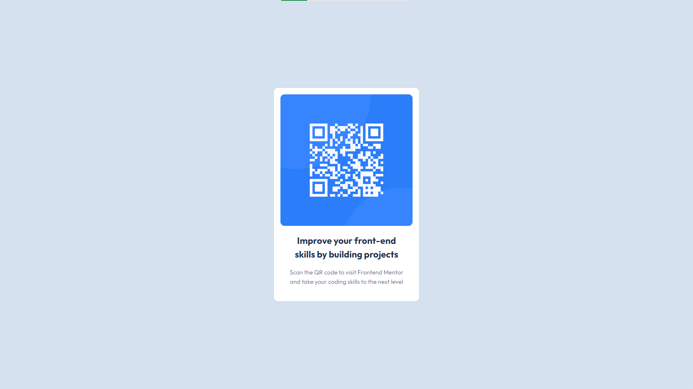

# Frontend Mentor - QR code component solution

This is a solution to the [QR code component challenge on Frontend Mentor](https://www.frontendmentor.io/challenges/qr-code-component-iux_sIO_H). Frontend Mentor challenges help you improve your coding skills by building realistic projects.

## Table of contents

-   [Overview](#overview)
    -   [Screenshot](#screenshot)
    -   [Links](#links)
-   [My process](#my-process)
    -   [Built with](#built-with)
    -   [What I learned](#what-i-learned)
    -   [Continued development](#continued-development)
    -   [Useful resources](#useful-resources)
-   [Author](#author)
-   [Acknowledgments](#acknowledgments)

**Note: Delete this note and update the table of contents based on what sections you keep.**

## Overview

### Screenshot

### Links

-   Solution URL: https://github.com/fjorwb/frontendmentor-qr-component
-   Live Site URL: https://master--fjorwb-frontendmentor-qr-component.netlify.app

## My process

### Built with

-   Semantic HTML5 markup
-   CSS custom properties
-   Flexbox
-   CSS Grid
-   [React](https://reactjs.org/) - JS library

### What I learned

This project allow me to practice with React and CSS, and project starting with Vite with React template.

### Useful resources

-   [Vite](https://vitejs.dev/guide/) - This helped me to launch the project structure with this alternativo to CRA

## Author

-   Website - https://www.foliveri.com
-   Frontend Mentor - https://www.frontendmentor.io/profile/fjorwb
-   Twitter - https://twitter.com/FjoliveriWb
